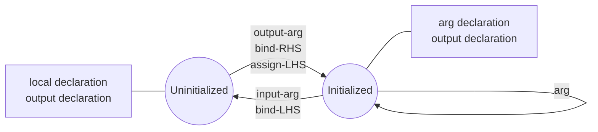

# Quantum Variables

A model operates on quantum objects, by modifying their states using different kinds of
operations. Quantum objects represent values that are stored on one or more qubits. The simplest
quantum object is a single qubit, representing the values 0 or 1 when measured. Other types
of quantum objects are stored on multiple qubits and represent numeric values or arrays of qubits.

Quantum objects are managed in Qmod using quantum variables. Variables are introduced into
the scope of a quantum function through the declaration of arguments or the declaration of
local variables.

A quantum variable establishes its reference to some object by explicitly initializing it. This
is often done by passing it as the output argument of a function, such as `allocate()`.
Once initialized, the state of the object it references can be modified, but the variable's
reference itself is immutable.

=== "Native"

    ```
    qfunc main(output q1: qbit) {
      q2: qbit;
      allocate(q1);
      allocate(q2);
      CX(q1, q2);
    }
    ```

=== "Python"

    A quantum variable is declared as a function argument using a Python class as a
    type hint. The same Python class is instantiated to declare a local variable,
    in which case the name of the variable is optionally specified as a constructor
    argument and otherwise inferred automatically.

    ```python
    from classiq import Output, QBit, allocate, qfunc, CX


    @qfunc
    def main(q1: Output[QBit]):
        q2 = QBit()  # The variable name can be set explicitly: QBit("q")
        allocate(q1)
        allocate(q2)
        CX(q1, q2)
    ```

## Managing Quantum Variables

Here are the rules for managing quantum variables:

-   Local variables and output-only arguments (arguments declared with the `output`
    modifier) are uninitialized upon declaration.
-   Quantum arguments declared without a modifier or with the `input` modifier are
    guaranteed to be initialized.
-   A variable is initialized in one of the following ways:
    -   It is passed as the output-only argument of a function
    -   It is used as the left-value of an assignment
    -   It occurs on the right side of a `->` (bind) statement
-   Once initialized, a variable can be used as an argument in any number of quantum
    function calls, as long as it is not an output only or input-only argument (an argument
    declared with the `output` or `input` modifier).
-   An initialized variable returns to its uninitialized state in one of the following ways:
    -   It is passed as the input-only argument of a function
    -   It occurs on the left side of a `->` (bind) statement

The following diagram illustrates these rules:



In the next example, the local variable `a` must be initialized prior to applying `X()`
on it, since it is declared as an output-only argument of function `main`. Similarly, the local
variable `b` is uninitialized upon declaration, and subsequently initialized through
the call to `prepare_state`, to which it is passed as an output-only argument.

=== "Native"

    ```
    qfunc main(output a: qbit) {
      allocate(a);
      X(a);
      b: qbit[];
      prepare_state([0.25, 0.25, 0.25, 0.25], 0.01, b);
    }
    ```

=== "Python"

    ```python
    from classiq import allocate, qfunc, QBit, QArray, prepare_state, Output, X


    @qfunc
    def main(a: Output[QBit]) -> None:
        allocate(a)
        X(a)
        b = QArray()
        prepare_state(probabilities=[0.25, 0.25, 0.25, 0.25], bound=0.01, out=b)
    ```
