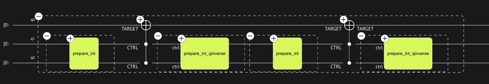

# Within-apply

The _within-apply_ statement performs the common quantum pattern $U^{\dagger} V U$. It
operates on two nested statement blocks, the _compute_ block and the _action_ blocks,
and evaluates the sequence - _compute_, _action_, and _invert(compute)_. Under conditions
described below, quantum objects that are allocated and prepared by the compute block
are subsequently un-computed and released.

## Syntax

=== "Native"

    **within** **{** _compute-statements_ **}** **apply** **{** _action-statements_ **}**

=== "Python"

    [comment]: DO_NOT_TEST
    ```python
    def within_apply(within: Callable, apply: Callable) -> None:
        pass
    ```

## Semantics

-   Unlike the case with other statements, the nested blocks of _within-apply_ may use
    outer context variables as output-only arguments.
-   To the extent that the _compute_ block does not introduce superposition into the quantum
    objects it operates on (i.e. is _quantum-free_), and the _action_ block does not modify
    the state of these objects, they are un-computed and returned to their state prior to the
    _within-apply_ statement.
-   Variables used as output-only arguments in the _compute_ block
    are reset to their uninitialized state after the _within-apply_ statement, and the qubits
    utilized by them return to the pool of qubits available for subsequent auxiliary allocations.
    -   This also applies to unreleased local variables in functions that are
        called under the _compute_ block at any level of nesting.
-   The application of the _compute_ block and its inverse are not subjected to redundant control logic in
    the case where the _within-apply_ statement as a whole is subject to control.
-   The application of the _compute_ block and its inverse are guaranteed to be strictly equivalent, including
    in the case where `compute` involves non-deterministic implementation decisions by the
    synthesis engine.

## Examples

### Example 1

The following example demonstrates how auxiliary qubits get used, un-computed, and reused
at different steps of a computation, when scoped inside a _within-apply_ statement.
Actual reuse is a decision the synthesis engine takes to satisfy width constraints.

=== "Native"

    ```
    qfunc main(output res: qbit) {
      allocate(res);
      ctrl: qbit[];
      within {
        ctrl = 3;
      } apply {
        CCX(ctrl, res);
      }
      within {
        ctrl = 2;
      } apply {
        CCX(ctrl, res);
      }
    }
    ```

=== "Python"

    ```python
    from classiq import *


    @qfunc
    def main(res: Output[QBit]) -> None:
        allocate(res)
        ctrl = QArray()
        within_apply(lambda: assign(3, ctrl), lambda: CCX(ctrl, res))
        within_apply(lambda: assign(2, ctrl), lambda: CCX(ctrl, res))
    ```

Note how variable `ctrl` is used as an output-only argument and initialized in the
_compute_ block, prior to being used for the `CCX` in the _action_ block.
Outside the _within-apply_ statement the variable is reset to its uninitialized state,
and used again in the same way.

Visualizing the resulting quantum program, you can see how the same two auxiliary
qubits are reused across the two steps of the circuit, because of width optimization.



### Example 2

The code snippet below demonstrates the preparation and release of an auxiliary qubit
to achieve phase kickback.

=== "Native"

    ```
    qfunc prep_minus(output out: qbit) {
      allocate(out);
      X(out);
      H(out);
    }

    qfunc my_phase_oracle(predicate: qfunc (vars: qbit[], res: qbit), vars: qbit[]) {
      aux: qbit;
      within {
        prep_minus(aux);
      } apply {
        predicate(vars, aux);
      }
    }
    ```

=== "Python"

    ```python
    from classiq import allocate, Output, QBit, qfunc, QCallable, QArray, within_apply, X, H


    @qfunc
    def prep_minus(out: Output[QBit]) -> None:
        allocate(out)
        X(out)
        H(out)


    @qfunc
    def my_phase_oracle(
        predicate: QCallable[QArray[QBit], QBit], vars: QArray[QBit]
    ) -> None:
        aux = QBit()
        within_apply(lambda: prep_minus(aux), lambda: predicate(vars, aux))
    ```

### Example 3

The code snippet below demonstrates the use of `within_apply` to define the Grover operator,
avoiding redundant control logic when called in higher-level contexts (for example, when
used as the unitary operand in a phase-estimation flow):

=== "Native"

    ```
    qfunc my_grover_operator(oracle: qfunc (qbit[]), space_transform: qfunc (qbit[]), target: qbit[]) {
      oracle(target);
      within {
        invert {
          space_transform(target);
        }
      } apply {
        reflect_about_zero(target);
      }
    }
    ```

=== "Python"

    ```python
    from classiq import *


    @qfunc
    def my_grover_operator(
        oracle: QCallable[QArray[QBit]],
        space_transform: QCallable[QArray[QBit]],
        target: QArray[QBit],
    ) -> None:
        oracle(target)
        within_apply(
            lambda: invert(lambda: space_transform(target)),
            lambda: reflect_about_zero(target),
        )
    ```
